# Manual de Investigación de Incidente: Inyección SQL y Exfiltración DNS

## 📌 Contexto y Escenario

MySQL es una base de datos popular utilizada por numerosas aplicaciones web. Desafortunadamente, la inyección SQL es una técnica común de ciberataque. Se trata de una técnica de inyección de código en la que un atacante ejecuta sentencias SQL maliciosas para controlar el servidor de base de datos de una aplicación web.
Por otro lado, los servidores de nombres de dominio (DNS) son directorios de nombres de dominio que los traducen a direcciones IP. Este servicio puede utilizarse para exfiltrar datos.

El personal de ciberseguridad ha determinado que se ha producido una vulnerabilidad de seguridad y que datos que contienen información personal identificable (PII) podrían haber quedado expuestos a amenazas. En este laboratorio/investigación, utilizaré Kibana para investigar las vulnerabilidades y determinar qué datos se exfiltraron mediante HTTP у DNS durante los ataques.

---

## 🔍 Fase 1: Preparación y Verificación del Entorno

**1. Comprobación de servicios**
Una vez iniciamos nuestra máquina, el primer paso es revisar los servicios que están corriendo para asegurarnos de que tenemos disponibles todas las herramientas necesarias para la investigación.
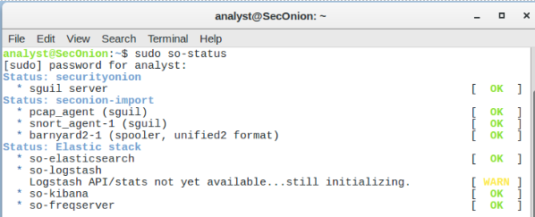

**2. Acceso al panel de monitorización**
Una vez verificado el estado del sistema, abrimos Kibana, nuestra herramienta principal de análisis, donde se nos mostrarán los eventos de seguridad registrados.

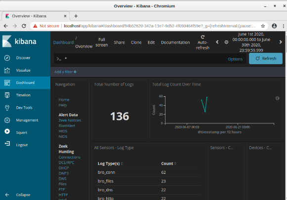

---

## 🕸️ Fase 2: Análisis de Tráfico HTTP (Inyección SQL)

**3. Filtrado por protocolo web**
En Kibana disponemos de un panel de navegación segmentado por protocolos. Dado que las inyecciones SQL se realizan a través de peticiones web, configuramos la consulta para visualizar únicamente las alertas `HTTP` que ocurrieron durante el mes de junio de 2020.

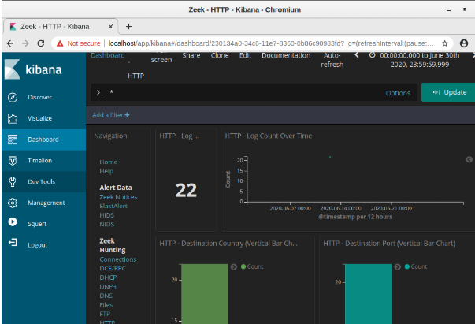

**4. Identificación de los actores**
Al analizar los registros, observamos un patrón claro: las consultas web provienen de un único origen (el atacante, IP `209.165.200.227`) dirigidas hacia un único destino (el servidor víctima, IP `209.165.200.235`).

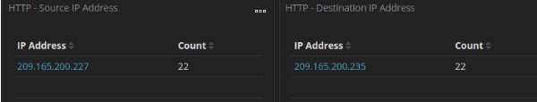

**5. Análisis del patrón de ataque**
Revisando los logs en detalle, detectamos que se realizan múltiples peticiones desde el mismo origen al mismo destino en un intervalo de tiempo muy corto, un comportamiento típico de herramientas automatizadas de explotación.

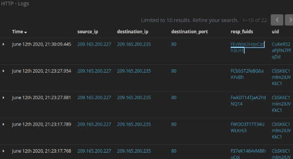

**6. Inspección de la alerta del IDS**
Obtenemos más información de la alerta y confirmamos que ha sido generada por Zeek (nuestro Sistema de Detección de Intrusos). Aquí podemos corroborar los puertos y las direcciones IP involucradas.

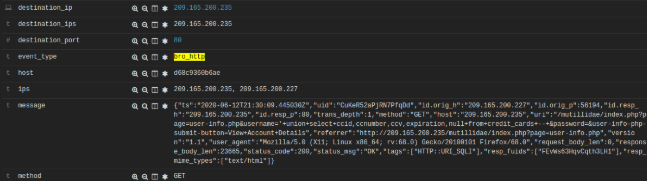

**7. Identificación del Payload (Carga útil)**
Al fijarnos en el mensaje de la petición `GET` HTTP, descubrimos la consulta exacta que se realizó. Es claramente una sentencia SQL maliciosa (utilizando un `UNION SELECT`) que intenta extraer información confidencial (como tarjetas de crédito y contraseñas) almacenada en la base de datos.

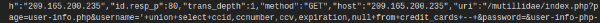

**8. Confirmación de la brecha de datos**
Para determinar si el ataque fue exitoso, es crucial examinar la respuesta del servidor. Como se observa en la imagen (con un código de estado `200 OK`), el servidor procesó la consulta y retornó los campos solicitados por el atacante en texto plano. El ataque fue exitoso y la información PII quedó expuesta.

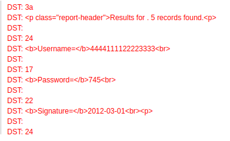

---

## 📡 Fase 3: Análisis de Tráfico DNS (Exfiltración de Datos)

El atacante no solo extrajo la información a través de la web, sino que utilizó técnicas alternativas para sacar datos del entorno.
**9. Filtrado por protocolo DNS**
Para investigar la exfiltración por DNS, seguimos una metodología similar a la fase anterior, pero esta vez filtramos las alertas generadas en el tráfico `DNS`.

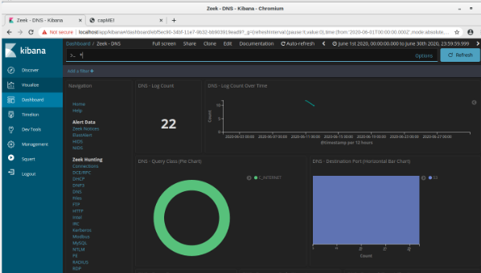

**10. Revisión de servidores involucrados**
El panel nos muestra las direcciones IP de los clientes DNS y los servidores a los que se han realizado las solicitudes.

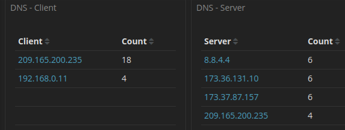

**11. Detección de anomalías en las consultas**
Al examinar las consultas DNS específicas, notamos algo inusual. Mientras que la primera solicitud parece legítima (`17.201.165.209.in-addr.arpa`), las siguientes consisten en cadenas largas de texto codificado (en formato hexadecimal) concatenadas al subdominio `.ns.example.com`. Este es un Indicador de Compromiso (IoC) claro de exfiltración de datos mediante consultas DNS.

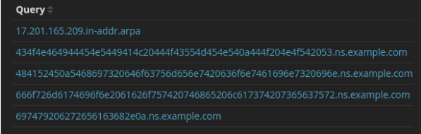

---

## 🔓 Fase 4: Extracción y Decodificación

**12. Exportación de evidencias**
Exportamos los registros de estas consultas a un archivo CSV para poder procesar y manipular los caracteres maliciosos cómodamente.

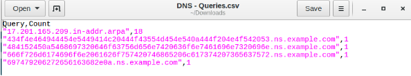

**13. Limpieza de los datos**
Nos quedamos únicamente con las cadenas hexadecimales que necesitamos. Para ello, eliminamos la primera consulta (que era legítima) y borramos el sufijo `.ns.example.com` de las consultas maliciosas para aislar el *payload*.

**14. Decodificación del mensaje exfiltrado**
Una vez tenemos el texto limpio, lo copiamos y lo pegamos en **CyberChef**. Utilizando la receta *"From Hex"*, logramos decodificar las peticiones para revelar el mensaje oculto que el atacante consiguió exfiltrar de la red.

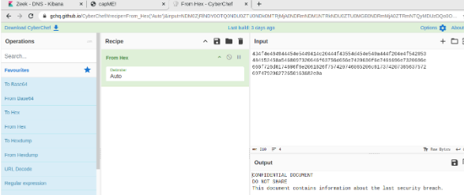
