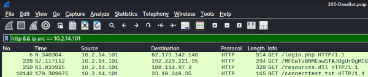
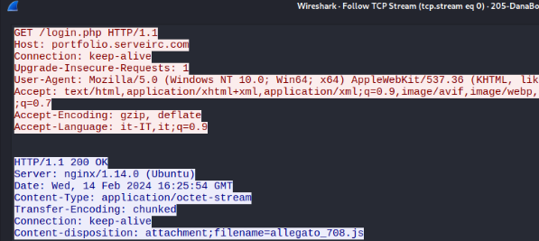
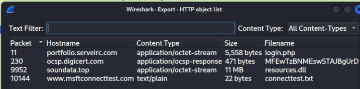
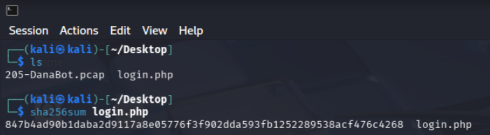
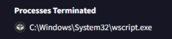
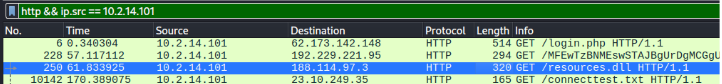
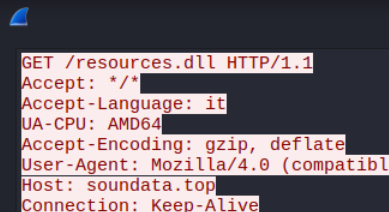
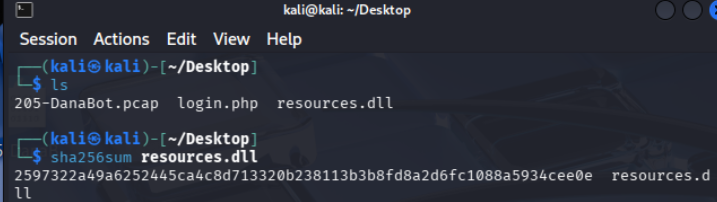
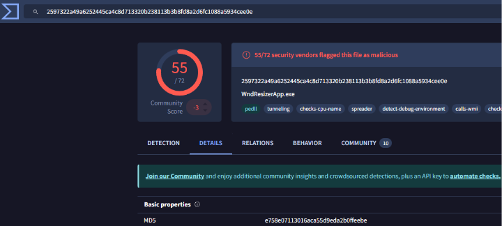

# 📄 CyberDefenders Lab – Network Forensics Investigation

## 📌 Descripción

Laboratorio de **CyberDefenders** donde se debe identificar el malware y mapear las técnicas del atacante utilizando **MITRE ATT&CK**.

---

## 🛠 Herramientas utilizadas

- Wireshark  
- AnyRun  
- VirusTotal  
- NetworkMiner  

---

## 🖥 Escenario

El equipo del SOC ha detectado actividad sospechosa en el tráfico de red, lo que revela que una máquina ha sido comprometida. Se ha robado información confidencial de la empresa.

Su tarea consiste en utilizar archivos de Captura de Red (PCAP) e Inteligencia de Amenazas para investigar el incidente y determinar cómo se produjo la vulneración.

---

# 🔎 Análisis

---

## 1️⃣ ¿Qué dirección IP utilizó el atacante durante el acceso inicial?

### Procedimiento

1. Se abre el archivo `.pcap` en **Wireshark**.
2. Vamos a:

```
Estadísticas → Conversaciones
```

3. Observamos las comunicaciones establecidas.
4. Todas las peticiones parten desde la máquina víctima hacia una IP externa.

Filtrando por tráfico HTTP y la IP origen de la víctima:

```bash
http && ip.src == IP_VICTIMA
```


Se identifican los archivos descargados y la IP de destino desde donde se sirven.

### IP del atacante:

```
62.173.142.148
```

---

## 2️⃣ ¿Cuál es el nombre del archivo malicioso utilizado para el acceso inicial?

Se sigue la conversación TCP del primer registro (el que solicita `/login.php`).

En:

```
Follow → TCP Stream
```


Dentro del **HTTP Response Header**, se observa el nombre del archivo descargado.

### Archivo malicioso:

```
allegato.js
```

---

## 3️⃣ ¿Cuál es el hash SHA-256 del archivo malicioso utilizado para el acceso inicial?

### Procedimiento

1. Exportar el archivo desde Wireshark:

```
File → Export Objects → HTTP
```



2. Extraer el fichero correspondiente.
3. En un entorno seguro (VM o sandbox), calcular el hash:

```bash
sha256sum allegato.js
```



### SHA-256:

```
847b4ad90b1daba2d9117a8e05776f3f902dda593fb1252289538acf476c4268
```

---

## 4️⃣ ¿Qué proceso se utilizó para ejecutar el archivo malicioso?

Se puede determinar:

- Buscando qué proceso ejecuta archivos `.js` en Windows.
- Analizando el comportamiento en **VirusTotal** o **AnyRun**.



Los archivos `.js` suelen ejecutarse mediante:

```
wscript.exe
```

### Proceso utilizado:

```
wscript.exe
```

---

## 5️⃣ ¿Cuál es la extensión del segundo archivo malicioso utilizado por el atacante?

Manteniendo el filtro HTTP activo y siguiendo la segunda conversación TCP, se observa la descarga de:



```
resources.dll
```




### Extensión:

```
.dll
```

---

## 6️⃣ ¿Cuál es el hash MD5 del segundo archivo malicioso?

### Procedimiento

1. Exportar el segundo archivo desde:

```
File → Export Objects → HTTP
```

2. Calcular el hash SHA-256 en entorno seguro:

```bash
sha256sum resources.dll
```



3. Introducir el hash en **VirusTotal** para obtener el MD5 correspondiente.




### MD5:

```
e758e07113016aca55d9eda2b0ffeebe
```

---

# 🧠 Técnicas MITRE ATT&CK observadas

- T1105 – Ingress Tool Transfer  
- T1059.007 – JavaScript  
- T1218 – Signed Binary Proxy Execution  
- T1204 – User Execution  
- T1574 – Hijack Execution Flow  

---

# 📌 Conclusión

Durante el análisis del tráfico de red se pudo determinar que:

- La víctima descargó un archivo JavaScript malicioso (`allegato.js`).
- Este fue ejecutado mediante `wscript.exe`.
- Posteriormente se descargó una segunda carga maliciosa (`resources.dll`).
- El atacante utilizó técnicas de descarga remota y ejecución mediante binarios legítimos del sistema.

El análisis combinado de PCAP y Threat Intelligence permitió reconstruir la cadena de infección completa.
