# 📄 XMLRat LAB – CyberDefenders

## 📌 Descripción

Laboratorio de **CyberDefenders** donde se debe identificar el malware y mapear las técnicas del atacante usando **MITRE ATT&CK**.

---

## 🛠 Herramientas utilizadas

- CyberChef  
- Wireshark  
- VirusTotal  
- Python3  
- PowerShell  

---

## 🖥 Escenario

Se ha detectado un equipo comprometido debido a tráfico de red sospechoso.

La tarea consiste en:

- Analizar el archivo PCAP  
- Determinar el método de ataque  
- Identificar cualquier carga maliciosa  
- Rastrear la cronología de los eventos  
- Identificar cómo el atacante obtuvo acceso  
- Determinar qué herramientas o técnicas utilizó  
- Analizar cómo operó el malware tras la vulneración  

---

# 🔎 Análisis

---

## 1️⃣ URL de descarga de la primera etapa

El atacante ejecutó un comando para descargar la primera etapa del malware.

### Procedimiento

1. Abrimos el archivo PCAP con **Wireshark**.
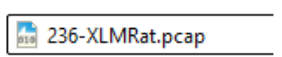
2. Filtramos por protocolo:

```bash
http
```
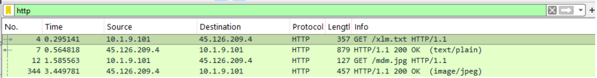


3. Localizamos la petición HTTP sospechosa.

En la capa de aplicación encontramos la URL:

```
http://45.126.209.4:222/mdm.jpg
```
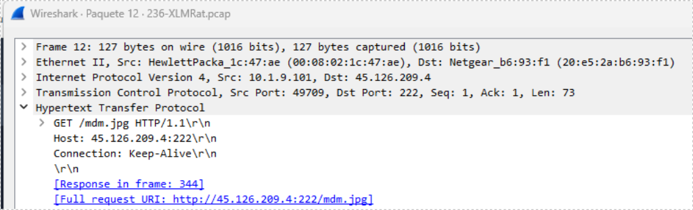

---

## 2️⃣ Hosting provider de la IP

Se introduce la IP en **VirusTotal**.

Una vez tenemos la dirección IP del servidor que figura en la URL la podemos pegar en VirusTotal y obtener información 

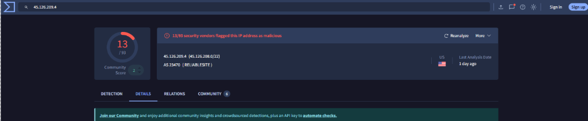

```
ReliableSite.net
```
Si nos vamos a los detalles podemos obtener la información del hosting provider 
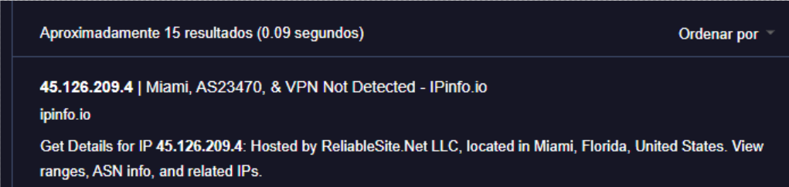

---

## 3️⃣ SHA256 del ejecutable del malware

Se identifican dos cargas:

- Loader  
- Ejecutable secundario  

### Procedimiento

1. En Wireshark → `Follow TCP Stream` para seguir la conversación que ha tenido cliente/servidor
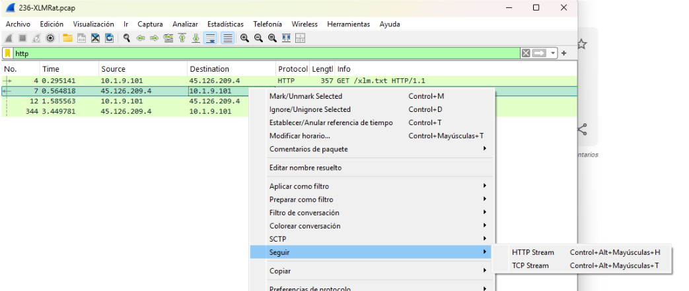
2. Copiar el contenido hexadecimal a partir de:

```
$hexString_bbb
```
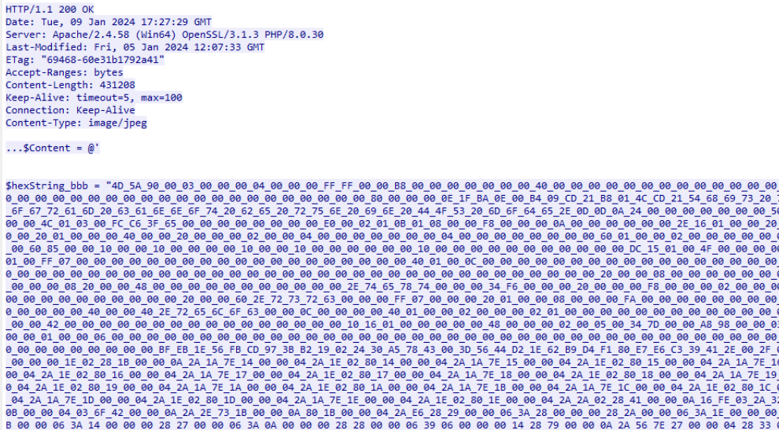


3. Convertir el contenido en **CyberChef** (Hex → Binary).
4. Obtener el hash.
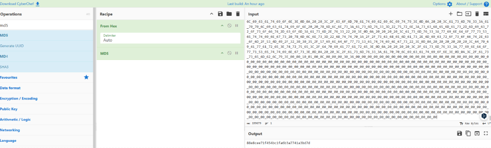
5. Verificar en VirusTotal.
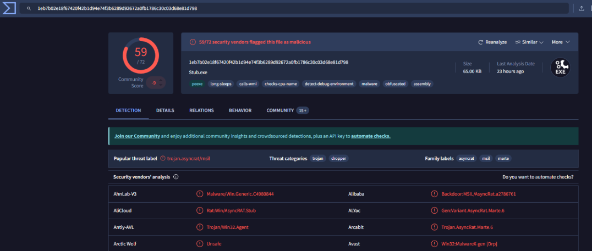
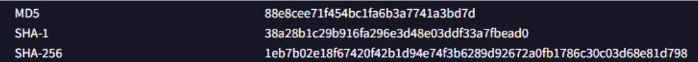


### SHA256:

```
1eb7b02e18f67420f42b1d94e74f3b6289d92672a0fb1786c30c03d68e81d798
```

---

## 4️⃣ Familia de malware según Alibaba

En VirusTotal → Vendor: Alibaba

Clasificación:
Es una puerta trasera que pertenece a la familia AsyncRat
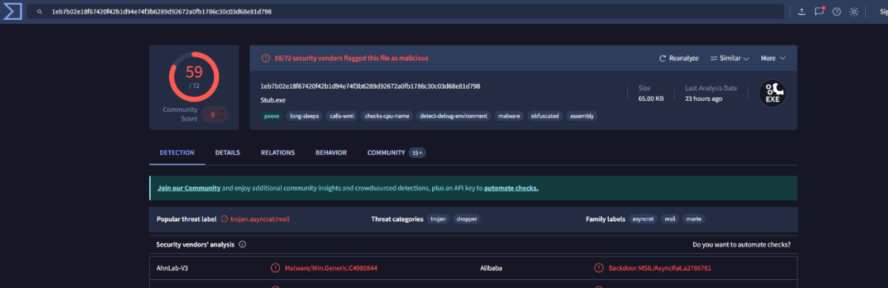

```
AsyncRat
```

---

## 5️⃣ Marca de tiempo de creación del malware

En VirusTotal → Details → History
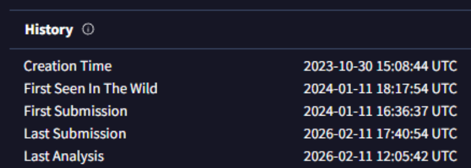

Fecha:

```
2023-10-30 15:08
```

---

## 6️⃣ LOLBin utilizado para ejecución sigilosa

En el script PowerShell analizado dentro del TCP Stream (Follow -> TCP stream) se observa el uso de un binario legítimo del sistema (LOLBin).
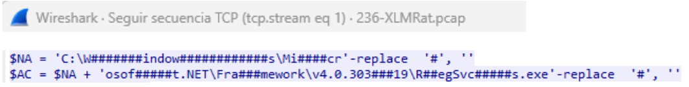
Ruta completa:

```
C:\Windows\Microsoft.NET\Framework\v4.0.30319\RegSvcs.exe
```

---

## 7️⃣ Archivos eliminados por el script

Analizando el TCP stream (comunicacion completa cliente/servidor) se identifican llamadas a:

```powershell
[IO.File]::WriteAllText()
```
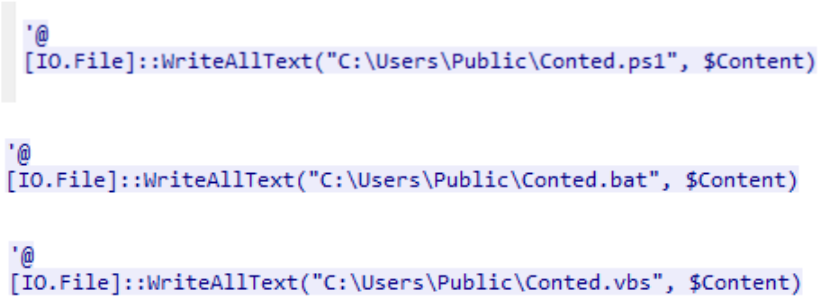

Archivos afectados:

```
Conted.vbs
Conted.ps1
Conted.bat
```

---

# 🧠 Técnicas MITRE ATT&CK observadas

- T1105 – Ingress Tool Transfer  
- T1059.001 – PowerShell  
- T1218 – Signed Binary Proxy Execution  
- T1036 – Masquerading  
- T1027 – Obfuscated/Compressed Files  

---

# 📌 Conclusión

El atacante:

- Descargó un ejecutable disfrazado como `.jpg`
- Utilizó PowerShell para reconstruir el payload
- Empleó un LOLBin (`RegSvcs.exe`) para ejecución sigilosa
- Implementó técnicas de evasión y ofuscación
- Desplegó AsyncRat como backdoor

---

Guarda las imágenes dentro de una carpeta llamada `images` en el repositorio:

```
XMLRat-Lab/
│
├── README.md
└── images/
    ├── 01-http-filter.png
    ├── 02-tcp-stream.png
    ├── 03-virustotal.png
```

Y añádelas así:

```markdown


```
